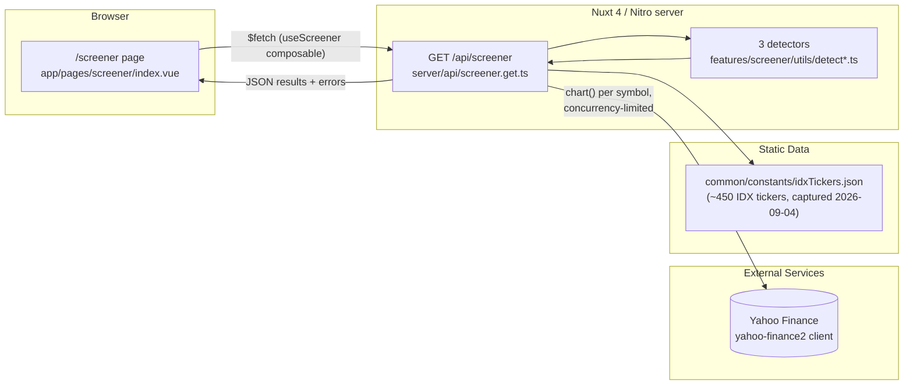

# IDX Screener App — Architecture

> Hub document. Each topic lives in its own folder under `flows/`. Keep this file short — detail lives in the spokes.

## TL;DR

A single-feature Nuxt 4 app: one page (`/screener`) posts a list of IDX tickers (or "the whole IHSG") to one server API route (`server/api/screener.get.ts:105`), which fetches daily OHLCV bars from Yahoo Finance, runs three chart-pattern heuristics over each ticker, and returns matches for the page to render, filter, sort, and export as CSV/XLSX. There is no database, no auth, no queue — the entire "backend" is one Nitro event handler that calls an external free API on every request. State lives only in the browser tab (Vue refs) and `localStorage` (theme preference only).

## System Overview

There is no async/queue layer and no persistent data store — every screener run is a synchronous (from the client's point of view) request/response cycle, internally fanned out with bounded concurrency.

## Topic Index

| Topic | What it covers | Status | Link |
|---|---|---|---|
| Screener | The whole feature: page → composable → API route → 3 detectors → conviction scoring → table/export | ready | [flows/screener](flows/screener/README.md) |
| Config & Runtime | `nuxt.config.ts` auto-registration/auto-import, per-environment config (`configs/*.json`), `runtimeConfig` | ready | [flows/cross-cutting/config-and-runtime](flows/cross-cutting/config-and-runtime/README.md) |
| Shared & Theming | `common/` folder conventions, dark/light theme, layout shell | ready | [flows/cross-cutting/shared-and-theming](flows/cross-cutting/shared-and-theming/README.md) |
| Testing & Quality | Vitest setup, ESLint feature-boundary rule, Husky pre-commit pipeline | ready | [flows/cross-cutting/testing-and-quality](flows/cross-cutting/testing-and-quality/README.md) |

### Explicitly out of scope

- **`common/components/`, `common/store/`, `common/types/`, `common/utils/`** are empty placeholder folders wired into `nuxt.config.ts` for future cross-feature code. Nothing lives there yet — see [Shared & Theming](flows/cross-cutting/shared-and-theming/README.md#empty-placeholder-folders).
- There is only one feature (`features/screener/`). The docs don't invent a multi-feature taxonomy that doesn't exist yet — `.eslintrc.cjs:1` already anticipates more features via `FEATURE_NAMES`, and the next one should get its own spoke under `flows/`.

## How to use this doc

- **New joiner?** Read this hub, then read the [Screener](flows/screener/README.md) spoke top to bottom — it is the entire product.
- **Looking for a specific flow?** Pick a row in the Topic Index and open the spoke folder.
- **Editing code?** Flip the spoke's `status` to `stale` when you change a file in its `code:` frontmatter. Reviewer flips back to `ready` after re-checking.
- **AI agents:** Load only the spoke `README.md` relevant to your task — diagrams and examples are inlined, no cross-file fetching needed.

## Reference

- [CONVENTIONS.md](CONVENTIONS.md) — doc template, frontmatter, diagram rules.
- [GLOSSARY.md](GLOSSARY.md) — domain terminology (screener criteria, config keys, external services).
- Repo-level [README.md](../../README.md) — product description, setup, and known limitations (Yahoo Finance `.JK` coverage, no bandarmology data, untuned thresholds).
