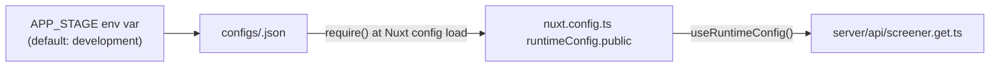

# Config & Runtime

## TL;DR

Two things are configured outside normal code: (1) Nuxt's auto-registration/auto-import scanning, which decides what's globally available without an explicit `import`, and (2) a tiny per-environment JSON file (`configs/<APP_STAGE>.json`) that feeds two tunable numbers into `runtimeConfig.public` at boot.

## Entry Points

- `nuxt.config.ts:1` — read top to bottom; every top-level key here changes global app behavior.
- `configs/development.json` / `configs/production.json` — selected via `process.env.APP_STAGE` (`nuxt.config.ts:2`), defaulting to `development`.

## How component auto-registration works

`nuxt.config.ts:14` registers two component directories with **prefixes**:

```ts
components: [
  { path: "~~/common/components/", prefix: "Common" },
  { path: "~~/features/screener/components/", prefix: "Screener" },
],
```

So `features/screener/components/SortableHeader.vue` is used in templates as `<ScreenerSortableHeader>` (see `app/pages/screener/index.vue:295`) with no `import` statement. Any component added to `common/components/` would be auto-registered as `<Common*>`. There is no directory scan for `app/pages/screener/` itself — page components use plain relative imports (e.g. `~~/features/screener/composables/useScreener`, `index.vue:3`).

**If you add a component and it isn't auto-registering:** confirm it's directly inside one of these two directories (not nested another level deeper without checking Nuxt's `pathPrefix` rules) and that the prefix matches what you're typing in the template.

## How composable/util auto-import works

`nuxt.config.ts:19` — the `imports.dirs` list makes every export from these three globs available with no `import`:

```ts
imports: {
  dirs: [
    "~~/common/composables/**",
    "~~/common/utils/**",
    "~~/features/screener/composables/**",
  ],
},
```

This is why `app/app.vue:2` can call `useColorScheme()` and `features/screener/composables/useScreener.ts` functions are usable in pages with no explicit import — but note **`features/screener/utils/*` is not in this list**, so detector/export utilities are always explicitly imported (see any file under `features/screener/utils/`, all import their siblings by relative path).

## Per-environment config → runtimeConfig



`configs/development.json` and `configs/production.json` are currently identical:

```json
{
  "env": {
    "maMelilitThresholdPct": 2,
    "defaultBars": 300
  }
}
```

- **`maMelilitThresholdPct`** — the max % spread allowed between the 5 dynamic MAs for a MA Melilit match. Only ever read server-side (`server/api/screener.get.ts:121`) — there's no client override.
- **`defaultBars`** — how many trading days of history to fetch when the client doesn't pass `?bars=`. Read server-side (`server/api/screener.get.ts:120`).

Both are exposed under `runtimeConfig.public` (`nuxt.config.ts:29`), meaning they're also readable client-side via `useRuntimeConfig().public`, though nothing in the client currently reads them.

**To change a threshold:** edit the relevant `configs/*.json` file and restart the dev server (or redeploy) — these are read once at Nuxt config load via a synchronous `require()` (`nuxt.config.ts:4`), not per-request.

## Failure & State

**Failure:** If `APP_STAGE` points at a config file that doesn't exist, `nuxt.config.ts:4`'s `require()` throws at startup — there's no fallback or validation. **State:** None — this is load-once config, not runtime-mutable state.

## See Also
- [Screener](../../screener/README.md) — the only consumer of these two config values.
