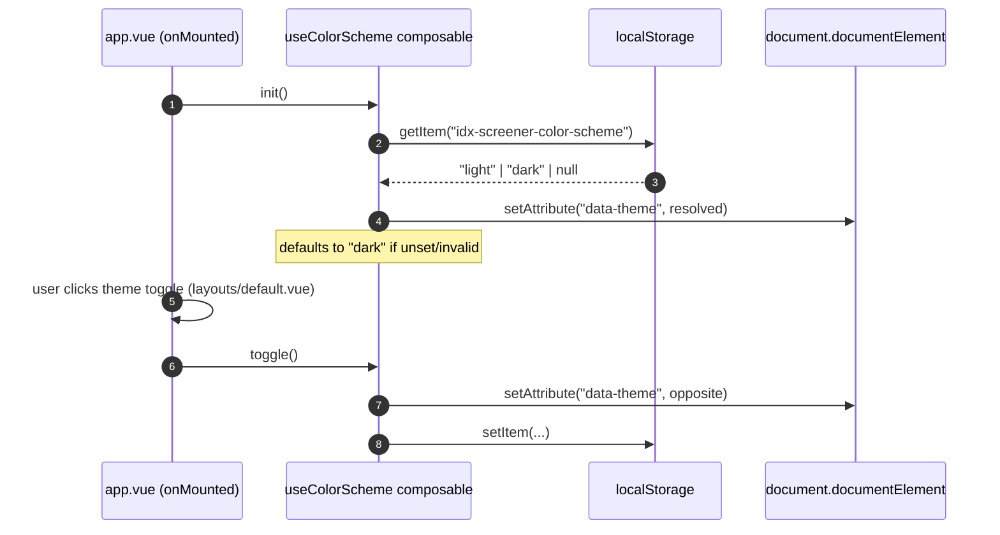

# Shared & Theming

## TL;DR

`common/` is the cross-feature grab-bag (only two files currently live there: a color-scheme composable and the static IDX ticker list). The app has exactly one layout, which renders a header with a dark/light toggle around whatever page is active.

## Entry Points

- `app/app.vue:1` — root component. Calls `useColorScheme().init()` on mount, wraps everything in `<NuxtLayout><NuxtPage /></NuxtLayout>`.
- `app/layouts/default.vue:1` — the (only) layout: header with title + theme toggle button, `<slot />` for page content.
- `common/composables/useColorScheme.ts:11` — `useColorScheme()`, auto-imported (see [Config & Runtime](../config-and-runtime/README.md#how-composableutil-auto-import-works)).

## Theming sequence

1. On mount, `init()` (`useColorScheme.ts:26`) reads `localStorage["idx-screener-color-scheme"]`; anything other than exactly `"light"` or `"dark"` falls back to `"dark"` (`isColorScheme()` guard, `useColorScheme.ts:7`).
2. The resolved scheme is written to `document.documentElement`'s `data-theme` attribute — CSS in `app/assets/css/theme.css` (loaded via `nuxt.config.ts:8`) presumably keys off this attribute for light/dark variables (`--color-bg`, `--color-accent`, etc., referenced in `app/layouts/default.vue:51-115`).
3. `scheme` is held in `useState<ColorScheme>("color-scheme", ...)` (`useColorScheme.ts:16`) — Nuxt's SSR-safe shared-ref primitive, so the value is consistent across components without prop-drilling.
4. All DOM/`localStorage` access is guarded by `import.meta.client` (`useColorScheme.ts:20,27`) since this composable can theoretically run during SSR.

## `common/constants/idxTickers.json`

A static array of `{ symbol, name }` for ~450 IDX-listed tickers (`wc -l` ≈ 1822 lines). Per `app/pages/screener/index.vue:231`, this was **captured from Stockbit's market-wide list on 2026-09-04** — it is not an official IDX register and may miss newly listed or inactive names. Used two places:
- `app/pages/screener/index.vue:23` — to show `universeSize` in the UI and as the ticker set for "Whole IHSG" mode.
- `server/api/screener.get.ts:13,23,109` — as the fallback symbol universe when `?symbols=` is omitted, and to resolve a symbol → display name (`NAME_BY_SYMBOL`).

**To refresh this list:** there's no script for it today — it was a manual capture. Replace the file wholesale, keeping the `{ symbol, name }[]` shape.

## Empty placeholder folders

`common/components/`, `common/store/`, `common/types/`, `common/utils/` exist as empty directories, already wired into `nuxt.config.ts` (auto-registration/auto-import globs) but hold no files today. They exist so that a second feature (or a genuinely cross-feature component/composable) has an obvious home without a `nuxt.config.ts` change. Don't add feature-specific code here — see the feature-boundary rule in [Testing & Quality](../testing-and-quality/README.md).

## Failure & State

**Failure:** None — this is UI-only, no network calls. **State:** Theme preference persists in `localStorage` under the key `idx-screener-color-scheme` (`useColorScheme.ts:5`); nothing else does.

## See Also
- [Config & Runtime](../config-and-runtime/README.md) — how `common/composables/**` becomes auto-imported.
- [Screener](../../screener/README.md) — the only real consumer of `idxTickers.json`.
