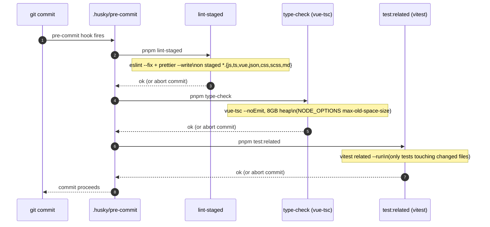

# Testing & Quality

## TL;DR

Vitest (with `@nuxt/test-utils` + `happy-dom`) for unit tests, coverage scoped to `features/**` and `common/**` only. ESLint enforces a hard cross-feature import boundary plus complexity/size caps. Husky's pre-commit hook runs lint-staged → type-check → related tests, in that order, before every commit.

## Entry Points

- `vitest.config.ts:5` — test runner config (environment, coverage, setup file, aliases).
- `test/setup.ts:1` — global test setup: mocks `fetch`, Nuxt's `#app` auto-imports, and `localStorage`.
- `.eslintrc.cjs:1` — lint rules, including the feature-boundary override.
- `.husky/pre-commit:1` — the actual gate: `pnpm lint-staged && pnpm type-check && pnpm test:related`.

## What runs, in order, on every commit



Any stage failing aborts the commit. This means **a broken build never reaches a commit** — if you need to skip it (e.g. WIP branch), that's a conscious `--no-verify`, not the default path.

## Vitest setup

- `vitest.config.ts:5` — `environment: "happy-dom"`, globals on (no explicit `import { describe, it }`), coverage via `istanbul`, scoped to `include: ["features/**/*.{ts,vue}", "common/**/*.{ts,vue}"]` and excluding `**/constants/**` and `**/types/**` — i.e. **coverage is only meaningful for feature/common logic**, not for pages, server routes, or config.
- `test/setup.ts:1` — every test gets: a mocked global `fetch` (`vitest-fetch-mock`), a mocked `#app` module (`useRuntimeConfig`, `navigateTo`, `useState`, `useRoute` — the Nuxt auto-imports most unit tests touch), and a mocked `localStorage`. This is why unit tests for composables like `useColorScheme` or `useScreener` don't need a full Nuxt runtime.
- Path aliases `~` and `@` both resolve to the repo root (`vitest.config.ts:29`).

## ESLint feature-boundary rule

`.eslintrc.cjs:1` maintains a `FEATURE_NAMES` array (today: `["screener"]`). For each feature, it adds a `no-restricted-imports` **warning** (not error) blocking imports from any *other* feature's folder:

```js
// .eslintrc.cjs:1
const FEATURE_NAMES = ["screener"];
```

**When adding a second feature**, append its folder name to this array — otherwise the new feature won't get boundary enforcement, and (per its own convention) neither will `screener` be protected from importing the new one. Shared logic that two features both need belongs in `common/`, not in either feature folder.

Other notable rules (`.eslintrc.cjs`): `complexity: 10`, `max-depth: 3`, `max-lines-per-function: 50`, `max-params: 3`, `max-lines: 500` per file, `no-explicit-any: error`, `explicit-function-return-type: error`. These are size/complexity caps applied repo-wide, not specific to any feature.

## Failure & State

**Failure:** A lint, type-check, or related-test failure blocks the commit entirely (`.husky/pre-commit:1`) — there is no "commit anyway" soft-fail path built in. **State:** None — these are all local, ephemeral CI-style checks; no results are persisted anywhere (no CI config exists in this repo, per the root [README.md](../../../../../README.md)'s stated goal of stripping product-specific CI setup from the `hub-chat` template this repo mirrors).

## See Also
- [Screener](../../screener/README.md) — the code these checks actually run against.
