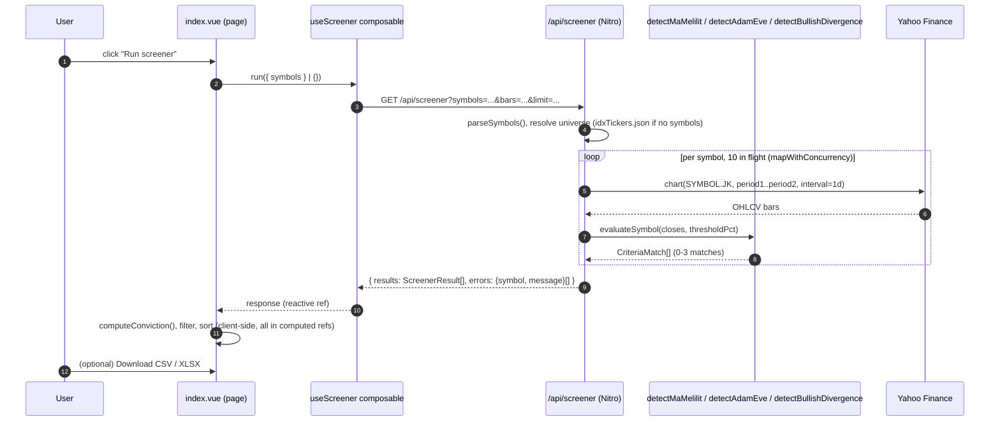

# Screener

## TL;DR

The whole product. A user types comma-separated IDX tickers (or picks "whole IHSG"), the page calls `GET /api/screener`, which fetches daily OHLCV bars per ticker from Yahoo Finance and runs three independent chart-pattern heuristics — **MA Melilit**, **Adam & Eve**, **Bullish Divergence** — against each. Matches come back with a `confidence` (low/medium/high) per criteria; the client derives an aggregate **conviction** score, then lets the user filter, sort, and export the table.

## Entry Points

- `app/pages/screener/index.vue:185` — `onRun()`, fired by the "Run screener" button. Builds the ticker list (manual textarea or full universe) and calls `run()`.
- `features/screener/composables/useScreener.ts:19` — `useScreener()`. Owns `isLoading`/`response`/`error` state and does the actual `$fetch` to the API route.
- `server/api/screener.get.ts:105` — the only server entry point. A Nitro `defineEventHandler` reached via `GET /api/screener?symbols=...&bars=...&limit=...`.

## Sequence



1. **Resolve the ticker universe.** `server/api/screener.get.ts:107` parses `?symbols=` (comma-separated, uppercased); if absent, the full `common/constants/idxTickers.json` list (~450 tickers) is used, optionally capped by `?limit=`.
2. **Fetch bars per symbol, bounded concurrency.** `mapWithConcurrency` (`features/screener/utils/concurrency.ts:4`) runs at most `FETCH_CONCURRENCY = 10` (`server/api/screener.get.ts:21`) Yahoo Finance requests at once — screening the whole universe sequentially would be too slow, and firing ~450 requests at once risks tripping Yahoo's unofficial rate limits.
3. **Fetch OHLCV.** `fetchBars()` (`server/api/screener.get.ts:41`) requests `bars * 1.6` calendar days (`CALENDAR_PADDING`, to pad for weekends/holidays) of daily bars for `<SYMBOL>.JK` via `yahoo-finance2`.
4. **Run the 3 detectors.** `evaluateSymbol()` (`server/api/screener.get.ts:64`) runs all three detectors against the closing-price series and keeps only non-null matches (a symbol can match 0–3 criteria).
5. **Return results + per-symbol errors.** A failed fetch for one symbol (`screenOne()`, `server/api/screener.get.ts:84`) does not fail the whole request — it's collected into `errors[]` alongside successful `results[]`.
6. **Client renders, filters, sorts, exports** — all client-side, no further server calls. See [Result table, filtering, sorting](#result-table-filtering-sorting-all-client-side) below.

## The three detectors

All three take a plain `number[]` of closing prices (and sometimes a threshold) and return `CriteriaMatch | null` — no shared base class, no framework, just pure functions. Each is a heuristic, not a validated trading signal (see repo [README.md](../../../../README.md)).

| Criteria | File | What it checks |
|---|---|---|
| **MA Melilit** ("weaving") | `features/screener/utils/detectMaMelilit.ts:38` | The 5 dynamic SMAs (periods 3/5/10/20/50, `DYNAMIC_MA_PERIODS` in `features/screener/constants/index.ts:12`) are within `thresholdPct` of each other (dispersion), and counts how many times any two swap relative order over the last `WEAVE_WINDOW = 10` bars (`detectMaMelilit.ts:6`) — more flips ⇒ higher confidence. |
| **Adam & Eve** | `features/screener/utils/detectAdamEve.ts:19` | Takes the last two swing lows (`findSwingLowIndices`, lookback ±3 bars); requires a swing high between them and the two lows within `MAX_BOTTOM_DIFF_PCT = 4%` of each other. Confidence rises if the first low is measurably "sharper" than the second (`sharpness()`, a cheap slope proxy — not real curve-fitting). |
| **Bullish Divergence** | `features/screener/utils/detectBullishDivergence.ts:9` | Computes RSI(14) (`technicalindicators` package) and compares it at the same two swing lows used above: price makes a **lower** low while RSI makes a **higher** low. Confidence rises with a bigger RSI gap and if the second low is within the last 10 bars. |

Shared building blocks:
- `features/screener/utils/swings.ts:1` — `findSwingLowIndices` / `findSwingHighIndices`: a value at index `i` is a swing point if it's the min/max within a `±lookback` window. `SWING_LOOKBACK = 3` (`constants/index.ts:17`).
- `features/screener/utils/maSeries.ts:36` — `buildDynamicMaSeries`: wraps `technicalindicators`' `SMA.calculate` and left-pads each series so index `k` lines up with `closes[k]` (the library's own output is 0-based and `period - 1` shorter).
- `features/screener/utils/arrayAt.ts:4` — `at()`: a bounds-checked array accessor used everywhere indices are "known safe" (e.g. straight from `findSwingLowIndices` on the same array), to satisfy TypeScript's `noUncheckedIndexedAccess` without scattering non-null assertions.

## Conviction scoring

`features/screener/utils/conviction.ts:13` — `computeConviction(matches)` is purely a client/export-side aggregate (not computed server-side, not part of `ScreenerResult`). Each match's `confidence` is weighted (`high=3, medium=2, low=1`) and summed; `score >= 6` → `high`, `>= 3` → `medium`, else `low`. This deliberately rewards **corroboration across multiple criteria** over one strong single match — one lone `high`-confidence match alone scores `medium`, not `high`.

## Result table, filtering, sorting (all client-side)

Everything below `useScreener()`'s response lives entirely in `app/pages/screener/index.vue` as Vue `computed` refs — there is no second API call:

- **Filters** (`index.vue:34-114`): free-text symbol/name search, last-close min/max range, and multi-select chips for criteria, confidence, and conviction. All combine with AND semantics (`filteredResults`, `index.vue:116`).
- **Sorting** (`index.vue:128-176`): by symbol, last close, conviction (via `CONVICTION_RANK`), or match count. Toggled via `ScreenerSortableHeader` (`features/screener/components/SortableHeader.vue`), which just emits a `sort` event — the parent owns direction state.
- **Column filter popovers**: `features/screener/components/ColumnFilterPopover.vue` — a `Teleport`-to-body popover positioned via `getBoundingClientRect()`, closed on outside click (`onClickOutside`) or scroll (`useEventListener`), both from `@vueuse/core`.
- **Export** (`features/screener/utils/exportResults.ts:70`): `downloadResults(sortedResults, format)` — exports exactly what's currently sorted/filtered on screen, as CSV (hand-rolled, RFC-4180-ish escaping) or XLSX (via the `xlsx` package). Triggers a browser download via an in-memory `<a download>` anchor + `URL.createObjectURL`.

## Data

Request: `GET /api/screener?symbols=BBRI,BBCA,TLKM&bars=300`

Response (`ScreenerResponse`, `features/screener/types/index.ts:28`):

```json
{
  "results": [
    {
      "symbol": "BBRI",
      "name": "Bank Rakyat Indonesia (Persero) Tbk",
      "lastClose": 4120,
      "matches": [
        {
          "criteria": "ma_melilit",
          "confidence": "high",
          "detail": "MA3/5/10/20/50 spread 1.42% (threshold 2%), 3 crossover(s) in the last 10 bars"
        },
        {
          "criteria": "bullish_divergence",
          "confidence": "medium",
          "detail": "Price lower low (4050 -> 3980), RSI higher low (28.4 -> 33.1)"
        }
      ]
    }
  ],
  "errors": [
    { "symbol": "XYZZ", "message": "No data found, symbol may be delisted" }
  ]
}
```

`bars` defaults to `runtimeConfig.public.defaultBars` (see [Config & Runtime](../cross-cutting/config-and-runtime/README.md)) when omitted. `thresholdPct` for MA Melilit is never a query param — it always comes from `runtimeConfig.public.maMelilitThresholdPct`.

## Failure & State

**Failure:** Per-symbol fetch failures (bad ticker, Yahoo rate-limit, no data) are caught in `screenOne()` (`server/api/screener.get.ts:84`) and returned as `{ symbol, message }` entries in `errors[]` — they never throw and never fail the batch. A request-level 400 (`server/api/screener.get.ts:112`) is thrown only if the resolved symbol list is empty. The client renders `errors[]` in a collapsed `<details>` (`index.vue:469`) and any composable-level fetch error in `error.value` (`useScreener.ts:35`).

**State:** No database, no server-side session, no cache. Every run re-fetches from Yahoo Finance. The only thing that survives a page reload is the theme preference (`localStorage`, see [Shared & Theming](../cross-cutting/shared-and-theming/README.md)) — filters, sort, and results reset on navigation.

Product pitch, setup, and known limitations: [repo README](../../../../README.md).

## See Also
- [Config & Runtime](../cross-cutting/config-and-runtime/README.md) — where `defaultBars` / `maMelilitThresholdPct` / `Screener*`-prefixed component auto-registration come from.
- [Shared & Theming](../cross-cutting/shared-and-theming/README.md) — `idxTickers.json` provenance, layout shell.
- [Testing & Quality](../cross-cutting/testing-and-quality/README.md) — how detectors and utils are unit-tested.
